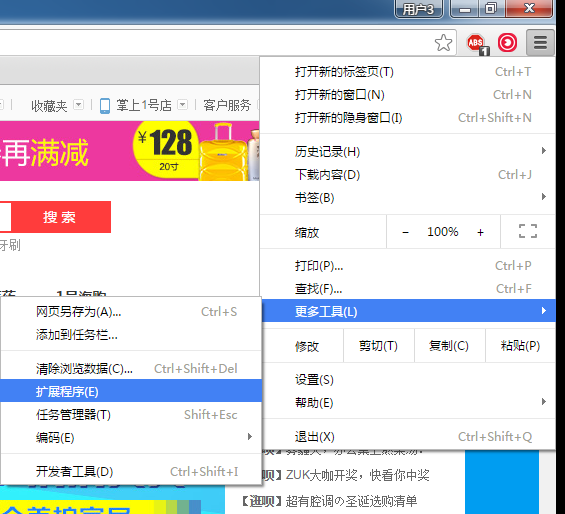
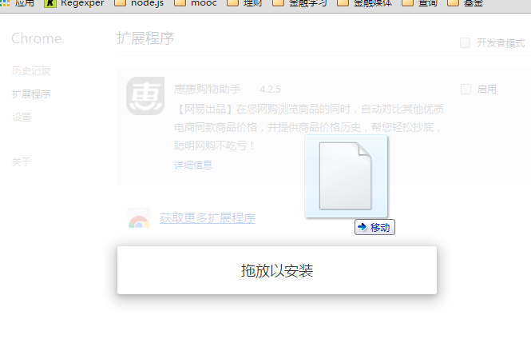

# qrcode_chrome_plugs
## install
 下载：<a href="https://github.com/wchaowu/qrcode_chrome_plugs/releases/download/1.0.0/qrcode_chrome_plugs.crx"> chrome-plugins-qrcode.crx </a>
 将文件拖到，chrome插件库选项，进行安装
  
  

## 功能:
1. 默认根据当前页面路径的URL生成二维码
2. 在输入框手动输入文本，点击按钮或者enter生成二维码

 
## License 
MIT License
